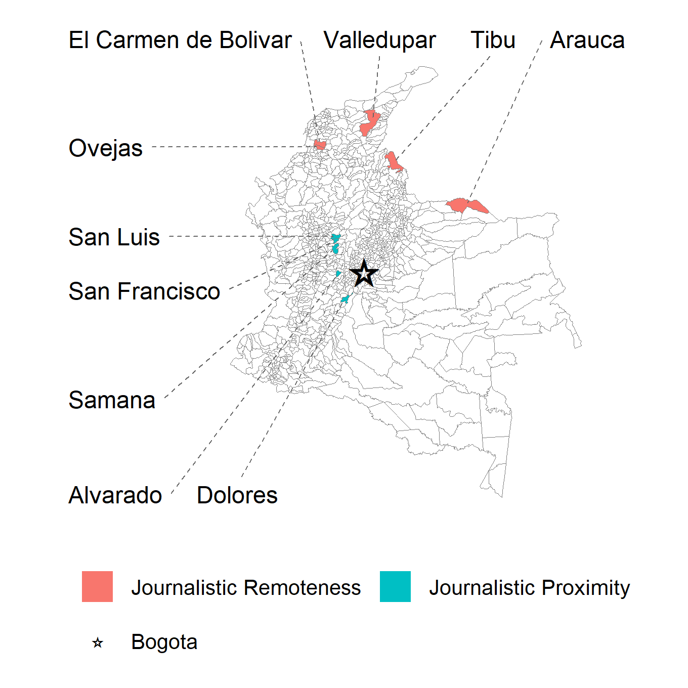

```{r setup, include=FALSE}
knitr::opts_chunk$set(cache      = FALSE,
                      echo       = FALSE,
                      out.width  = "100%",
                      dpi        = 350)

# INLA Models
load("tidy-mods.Rdata")
load("../Plots/coef-plot.Rdata")

# Discrete probit models
load("../discrete-mods.RData")

library(kableExtra)
library(magrittr)
```

<!---------------------------------------------------------------------------->
<!----------------------- Additional document setup -------------------------->

```{r}

custom_table <- function(data, cap, footnote = NULL){
  kbl(x         = data,
      caption   = cap,
      escape    = FALSE,
      col.names = linebreak(c("", "ICEWS", "GED", "CINEP", "ICEWS\nUnderreporing","GED\nUnderreporting"),
                            align = "c"),
      align     = c("l","c","c","c","c","c"),
      position  = "!ht",
      booktabs  = TRUE) %>%
  kable_styling(font_size = 10) %>% 
  collapse_rows(columns     = 1,
                valign      = "middle",
                latex_hline = "none") %>% 
  row_spec(8,  extra_latex_after = "\\cline{1-6}") %>% 
  row_spec(14, extra_latex_after = "\\cline{1-6}") %>% 
  footnote(general = footnote, footnote_as_chunk = T)
}

custom_table2 <- function(data, cap, footnote = NULL){
  kbl(x         = data,
      caption   = cap,
      escape    = FALSE,
      col.names = linebreak(c("", "ICEWS", "GED", "CINEP", "ICEWS\nUnderreporing","GED\nUnderreporting"),
                            align = "c"),
      align     = c("l","c","c","c","c","c"),
      position  = "!ht",
      booktabs  = TRUE) %>%
  kable_styling(font_size = 10) %>% 
  collapse_rows(columns     = 1,
                valign      = "middle",
                latex_hline = "none") %>% 
  row_spec(10,  extra_latex_after = "\\cline{1-6}") %>% 
  footnote(general = footnote, footnote_as_chunk = T)
}

custom_table3 <- function(data, cap, footnote = NULL){
  kbl(x         = data,
      caption   = cap,
      escape    = FALSE,
      col.names = linebreak(c("", "ICEWS", "GED", "CINEP", "ICEWS\nUnderreporing","GED\nUnderreporting"),
                            align = "c"),
      align     = c("l","c","c","c","c","c"),
      position  = "!ht",
      booktabs  = TRUE) %>%
  kable_styling(font_size = 10) %>% 
  collapse_rows(columns     = 1,
                valign      = "middle",
                latex_hline = "none") %>% 
  row_spec(08,  extra_latex_after = "\\cline{1-6}") %>% 
  footnote(general = footnote, footnote_as_chunk = T)
}

# Shrink HDP text size
tab_vals %<>%
  dplyr::mutate(across(contains(c("icews","ged","cinep")),
                       ~cell_spec(.x, font_size = ifelse(stringr::str_detect(.x, "\\["), 8, 10))))
probit_ns %<>%
  dplyr::select(-ids) %>% 
  dplyr::mutate(across(contains(c("icews","ged","cinep")),
                       ~cell_spec(.x, font_size = ifelse(stringr::str_detect(.x, "\\["), 8, 10))))
probit_sp %<>%
  dplyr::select(-ids) %>% 
  dplyr::mutate(across(contains(c("icews","ged","cinep")),
                       ~cell_spec(.x, font_size = ifelse(stringr::str_detect(.x, "\\["), 8, 10))))


```


<!---------------------------------------------------------------------------->


## 2002-2009
```{r}
cap <- "2002-2009"
fn  <- "Point estimates reflect posterior median, 95% HPD in brackets."

tmp <- tab_vals %>%
  dplyr::filter(years == cap) %>% 
  dplyr::select(-years)

custom_table(data = tmp, cap = cap, footnote = fn)
```

## 2002-2004
```{r}
cap <- "2002-2004"
fn  <- "Point estimates reflect posterior median, 95% HPD in brackets."

tmp <- tab_vals %>%
  dplyr::filter(years == cap) %>% 
  dplyr::select(-years)

custom_table(data = tmp, cap = cap, footnote = fn)
```


\pagebreak


## 2005-2007
```{r}
cap <- "2005-2007"
fn  <- "Point estimates reflect posterior median, 95% HPD in brackets."

tmp <- tab_vals %>%
  dplyr::filter(years == cap) %>% 
  dplyr::select(-years) 

custom_table(data = tmp, cap = cap, footnote = fn)
```


## 2008-2009
```{r}
cap <- "2008-2009"
fn  <- "Point estimates reflect posterior median, 95% HPD in brackets."

tmp <- tab_vals %>%
  dplyr::filter(years == cap) %>% 
  dplyr::select(-years) 

custom_table(data = tmp, cap = cap, footnote = fn)
```


\pagebreak


## 2002-2009
```{r}
cap <- "Probit: 2002-2009"
fn  <- "95% confidence interval in brackets estimated with robust standard errors."

custom_table3(data = probit_ns, cap = cap, footnote = fn)
```


## 2002-2009
```{r}
cap <- "Spatial Probit: 2002-2009"
fn  <- "95% confidence interval in brackets."

custom_table2(data = probit_sp, cap = cap, footnote = fn)
```


\pagebreak


### Coefficient and GMRF parameter plots for SPDE models for at least one FARC HRV 
#### Three Datasets In Indicated Periods

```{r, fig.width=6.5, fig.height=6.5, fig.align='center'}
event_final_plot
```


\pagebreak


### Coefficient and GMRF parameter plots for SPDE models of Undereporting of FARC HRVs 
#### ICEWS or GED in comparison with CINEP in Indicated Periods

```{r, fig.width=6.5, fig.height=6.5, fig.align='center'}
under_final_plot
```


\pagebreak

# Colombia Map
```{r, fig.align='center'}

```

